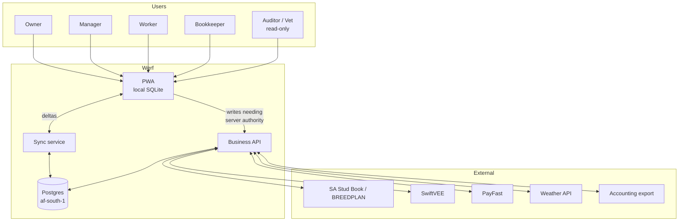

# Software Requirements Specification

**Project:** Werf · **Version:** 1.0 · **Date:** July 2026
**Conforms to:** IEEE 830 structure, adapted

---

## 1. Introduction

### 1.1 Purpose

This SRS specifies the complete behaviour of the Werf platform: an offline-first, installable web application for South African farm management supporting livestock, crop, and mixed enterprises.

Audience: the development team (human and AI), QA, and any third party assessing the system for compliance.

### 1.2 Scope

**Werf will:** act as a private farmer-controlled logbook, planner and calculator for animals,
fields, labour, wages, finances and inventory across the farms and enterprises the farmer chooses;
operate fully offline and synchronise when connectivity permits; and generate farmer-initiated
records or exports. Werf is not an authority, does not approve farm decisions and does not report
farm activity to authorities or third parties (ADR-0013).

**Werf will not:** trade livestock, lend money, formulate rations, control irrigation, file tax returns, replace an accounting general ledger, or require hardware.

### 1.3 Definitions

| Term | Meaning |
|---|---|
| **Farm** | A physical or legal production unit. A farm business may have several. |
| **Enterprise** | A profit centre within a farm business: "Beef cattle", "Maize", "Table grapes". The unit of financial attribution. |
| **Camp / Paddock** | A grazing area. Livestock analogue of a block. |
| **Block** | A crop production unit. May be split from a field. |
| **Mob / Herd / Flock** | A managed group of animals. The unit most livestock work happens against. |
| **Event** | An immutable record that something happened: a birth, a treatment, a spray, a shift. The core of the data model. |
| **Occurred-at** | When the thing happened on the farm. Distinct from created-at. |
| **Evidence Pack** | A generated PDF bundle for an external party (SAPS, auditor, inspector). |
| **RLS** | Postgres row-level security. Our tenancy boundary. |
| **Sync rules** | PowerSync's separate, parallel access-control layer. |

### 1.4 References

[BRD](../00-business/BRD.md) · [Legal & Compliance](../00-business/legal-compliance.md) · [Architecture](../03-architecture/architecture.md) · [Database Schema](../03-architecture/database-schema.md) · [API Spec](../03-architecture/api-specification.md) · [Offline & Sync](../03-architecture/offline-sync.md)

---

## 2. Overall description

### 2.1 Product perspective

Werf is a new, self-contained system. It integrates outward to: SA Stud Book (Logix) and BREEDPLAN for genetics import; SwiftVEE for auction listing; PayFast for subscription billing; weather APIs; accounting software for financial export; and SARS/UIF file formats. None of these are dependencies for core function — each degrades gracefully to manual entry or export.

### 2.2 Product functions

| Module | Function |
|---|---|
| **Onboarding** | Farm setup, enterprise-type selection, module configuration |
| **Livestock** | Individual + group records, breeding, health, weights, movements, grazing |
| **Crops** | Blocks, plantings, sprays, fertiliser, harvest, PHI enforcement |
| **Labour** | Employees, attendance, tasks, piece work, leave, payroll, statutory documents |
| **Finance** | Income, expenses, per-enterprise P&L, budgets, cost of production |
| **Inventory** | Chemicals, feed, spares, equipment, maintenance |
| **Compliance** | Animal ID register, stock theft evidence, GlobalGAP/SIZA checklists, obligations |
| **Reporting** | Dashboards, statutory reports, exports |
| **Platform** | Auth, RBAC, sync, offline, i18n, audit |

### 2.3 User classes

| Class | Frequency | Technical skill | Environment | Key constraint |
|---|---|---|---|---|
| Owner | Weekly | Medium | Office, desktop | Wants profit answers, not data entry. **2FA mandatory** — sees money and PII |
| Manager | Daily | Medium | Bakkie, phone, patchy signal | Speed of capture is everything |
| Worker | Daily | **Low** | Camp/crush/orchard, gloves, sun | Must not be able to break anything |
| Bookkeeper | Monthly | High | Office, desktop | Correctness, exports. **2FA mandatory** |
| External (vet, auditor, SAPS) | Rare | Varies | Anywhere | Read-only, scoped, time-limited |

The Worker class governs the UI. If a design works for a worker in a crush with cold hands, it works for everyone.

### 2.4 Operating environment

| | Requirement |
|---|---|
| Client | Chrome/Edge 111+, Safari 16.4+, Firefox 115+. Android 10+, iOS 16.4+. Mid-range device baseline: 4GB RAM, Snapdragon 680-class. |
| Install | PWA via browser install prompt. No app store. |
| Storage | OPFS for SQLite. Budget: 200MB for a 5,000-animal farm with 3 years of history. |
| Network | Must function indefinitely offline. Sync on 2G/EDGE must complete or resume. |
| Server | Postgres 16 + PostGIS, Node 22 LTS, containers on Linux, AWS af-south-1. |

**Safari 16.4 is the floor** because that is where iOS gained usable PWA push and OPFS. This excludes older iPhones; that is an accepted trade-off documented in [ADR-0001](../03-architecture/adr/ADR-0001-pwa-over-native.md).

### 2.5 Constraints

- **CON-1** Offline-first. Every capture path works with the radio off.
- **CON-2** SA data residency (risk decision — see [legal-compliance.md §1.4](../00-business/legal-compliance.md)).
- **CON-3** No regulated constant in code.
- **CON-4** No hardware dependency.
- **CON-5** English and Afrikaans at launch; the i18n layer must not need re-architecture to add isiZulu/isiXhosa.
- **CON-6** Data cost per sync must be defensible on a metered connection.

### 2.6 Assumptions and dependencies

Depends on: PowerSync (self-hosted) for sync; PostGIS for spatial; PayFast for billing. Each is an ADR with a documented exit.

---

## 3. Specific requirements

Functional requirements are catalogued separately in [functional-requirements.md](functional-requirements.md) (FR-001 … FR-4xx). Non-functional requirements in [non-functional-requirements.md](non-functional-requirements.md) (NFR-001 …). This section specifies the cross-cutting behaviours that do not belong to any one module.

### 3.1 Enterprise-type adaptation (the defining behaviour)

**SRS-1.** At onboarding, the farm business selects one or more enterprise types from: Beef cattle, Dairy, Sheep, Goats, Pigs, Poultry, Game, Row crops, Vegetables, Orchards, Vineyards, Other.

**SRS-2.** The selection drives, at runtime:
- which navigation items exist,
- which dashboard widgets render,
- which event types are offered at capture,
- the terminology used (a Beef farm says "camp"; a Vineyard says "block"; a Sheep farm says "flock"),
- which compliance obligations appear.

**SRS-3.** Adaptation is **additive and reversible**. Adding "Maize" to a cattle farm in month six must not require migration, re-onboarding, or data loss. Removing an enterprise type hides its UI but never deletes its data.

**SRS-4.** The underlying schema is **shared, not per-type**. There is one `animals` table, not `cattle` and `sheep`. Species-specific attributes live in a validated JSONB `attributes` column with a per-species Zod schema. This is the central architectural bet: see [ADR-0004](../03-architecture/adr/ADR-0004-enterprise-model.md).

> **Why this matters more than it looks:** every competitor either forces you into one farm type or makes you buy a module per species. The whole product promise collapses if a mixed farmer has to run two apps. SRS-1 through SRS-4 are the product.

### 3.2 Offline behaviour

**SRS-5.** The client reads and writes exclusively against local SQLite. No user-facing operation blocks on network I/O.

**SRS-6.** Writes queue durably and survive app close, browser restart, and device reboot.

**SRS-7.** Sync status is visible but never modal. A persistent, non-blocking indicator shows: synced / N pending / syncing / error. The user is never prevented from working by sync state.

**SRS-8.** Conflict resolution is last-write-wins **on a per-field basis**, using `occurred_at` where it exists and `updated_at` otherwise, with these exceptions:
- Financial transactions and payroll runs: **server authoritative**, client cannot overwrite.
- Immutable events (birth, treatment, spray): **append-only**; two clients recording the same real-world event produce two rows, deduplicated by a review queue, never auto-merged.
- Animal status: a state machine, not a value. `alive → sold` and `alive → dead` conflict resolves to `dead`.

**SRS-9.** Every conflict resolution writes an audit row. **No conflict is ever resolved silently.** Full specification: [offline-sync.md](../03-architecture/offline-sync.md).

**SRS-10.** Server-authoritative operations (payroll run, compliance pack generation, invoice) are **unavailable offline** and must say so plainly, with a queued-intent option where sensible. This is the one place we accept an online dependency, because a payslip computed on a stale rate table is worse than a payslip delayed.

### 3.3 Access control

**SRS-11.** Roles: `owner`, `manager`, `worker`, `bookkeeper`, `viewer`, `external` (time-limited, scoped).

**SRS-12.** Permissions are per-farm, not per-account. A person may be `manager` on farm A and `worker` on farm B.

**SRS-13.** Financial data is visible to `owner` and `bookkeeper` only. Health data (worker IOD) to `owner` and designated H&S role only. Enforced in **three** places: sync rules (what reaches the device), RLS (what the database returns), and API guards (what the server permits). All three, because any one alone is a single point of failure.

**SRS-14.** `external` grants are scoped to a resource set and expire. A vet gets treatment history for a herd for 30 days, not the farm.

### 3.4 Audit

**SRS-15.** Every mutation of an animal, employee, financial, or compliance record writes an immutable audit row: who, what, when, from where, before, after.

**SRS-16.** Audit rows are append-only at the database level (no UPDATE/DELETE grant) and are never exposed to the sync engine.

### 3.5 Internationalisation

**SRS-17.** All user-facing strings via i18n keys. English (en-ZA) and Afrikaans (af-ZA) at launch.

**SRS-18.** Locale affects: language, date format (DD/MM/YYYY), number format (space thousands separator, comma decimal — `1 234,56`), currency (R), units (metric, always).

**SRS-19.** Language is a **user** preference, not a farm preference. The owner reads English; the manager reads Afrikaans; the same farm.

**SRS-20.** Generated statutory documents (employment particulars, payslips, privacy notices) render
in the **recipient's** language, not the generator's. Phase 5 provides printable PDF and, for
editable employment particulars, Word (`.docx`) output; spreadsheet registers use the farmer's
chosen interface language.

### 3.6 Jurisdiction

**SRS-24.** Every farm carries a `jurisdiction` (ISO 3166-1 alpha-2). **v1 is locked to `ZA`** by a database CHECK constraint and shows no country selector.

**SRS-25.** Every regulated rule — wage calculation, animal identification, theft evidence, privacy regime, chemical registration, export audit — resolves through a **named interface with exactly one implementation (`ZA`)**. Adding a country is a directory plus a registry entry, not a refactor.

**SRS-26.** **No South African concept may name a generic thing.** `bceaThreshold` in `packages/core` is a defect; `earningsThreshold` on the interface with `BCEA_THRESHOLD` inside `jurisdictions/za/` is correct. `BCEA`, `POPIA`, `SD13`, `UIF`, `SARS`, `SAPS`, `SIZA` appear only in `jurisdictions/za/`, in the ZA legal pack, and in ZA user-facing copy.

**SRS-27.** Public holidays and genuinely server-authoritative payroll rates are filtered by the
farm's jurisdiction. Crop and veterinary products and intervals are farm-owned inputs, not public
reference data (ADR-0013).

> **Why build the seam for a country we do not serve:** the `jurisdiction` column costs one line today and a migration across 10,000 partitioned farms in year three. The interface costs one indirection today and a rewrite of the most legally-dangerous code in the system later. Both are cheap wrongs if the second country never comes. See [ADR-0006](../03-architecture/adr/ADR-0006-multi-jurisdiction.md) — and note what it refuses: no rules engine, no DSL, no plugin loader, no guessing.

### 3.7 Presentation

**SRS-28.** Theme is a **user** preference: light, dark, or match-my-phone. **Default light.** The system preference is not followed unless explicitly chosen — a farmer who set their phone to dark at night would otherwise find a mirror in their hand at noon in a crush, with no idea why.

**SRS-29.** Both themes meet the same contrast thresholds (NFR-403) and are audited in CI. A dark palette that passes on a designer's monitor and fails on a Galaxy A15 has failed.

**SRS-30.** **One difficulty level.** No simple/advanced mode; no easier phone version. Screen size changes **density**, never **difficulty** — the desktop shows more at once and never asks more of you. Same vocabulary, same patterns, same number of decisions per screen.

**SRS-31.** The home screen is a **grid of tiles generated from `farm.enterprise_types`** — fixed order, never personalised by usage (muscle memory is the entire value), each carrying one live number or one attention badge. It is the most visible expression of SRS-1–4.

### 3.8 Data portability

**SRS-32.** The farm can export all of its data at any time, self-service, without contacting support, in CSV (per entity) and JSON (full relational dump).

**SRS-33.** Export completes within 24 hours and is delivered as a signed, expiring link.

**SRS-34.** Import supports CSV with column mapping, and named importers for BenguFarm, Farmbrite, SA Stud Book (Logix), and generic Excel.

**SRS-35.** Phase-specific working documents are not deferred to the Phase 7 full-data export.
Labour provides farmer-initiated PDF/DOCX/XLSX outputs for the standard forms and an accountant pack.
Sensitive columns are excluded by default; generation is role-gated, audit-logged and never sent to
a third party automatically (ADR-0015).

> Migration-in is a growth feature and migration-out is a trust feature. Both are Phase 7. A product that traps data does not get recommended at a farmers' day.

---

## 4. Verification

Every requirement in this SRS and in the FR/NFR catalogues must be traceable to at least one automated test. `pnpm test:trace` (`scripts/test-trace.mjs`) reports which FRs are named by a test title; see [testing-strategy.md](../04-delivery/testing-strategy.md).

> **⚠️ It does not fail the build**, and this sentence used to say it did. It is report-only unless `--strict` is passed, and it measures naming rather than coverage. The obligation above is still the obligation; it is enforced by review, not by a gate.
