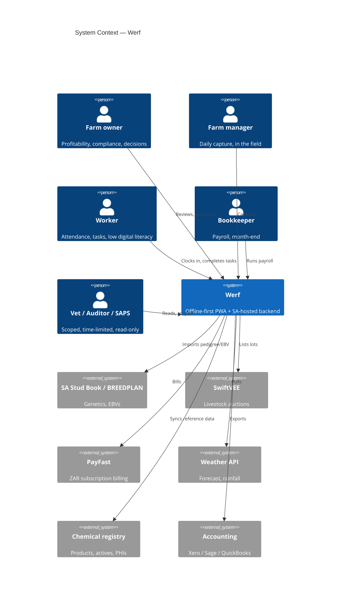
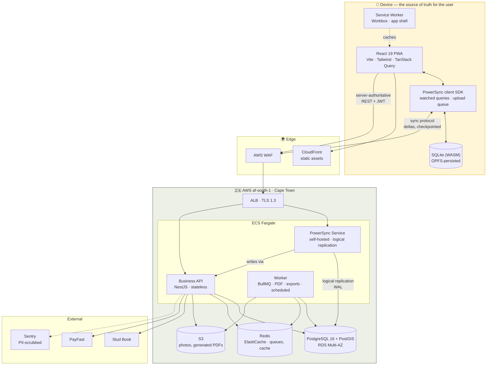
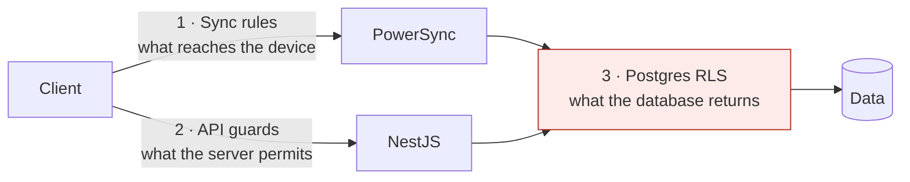
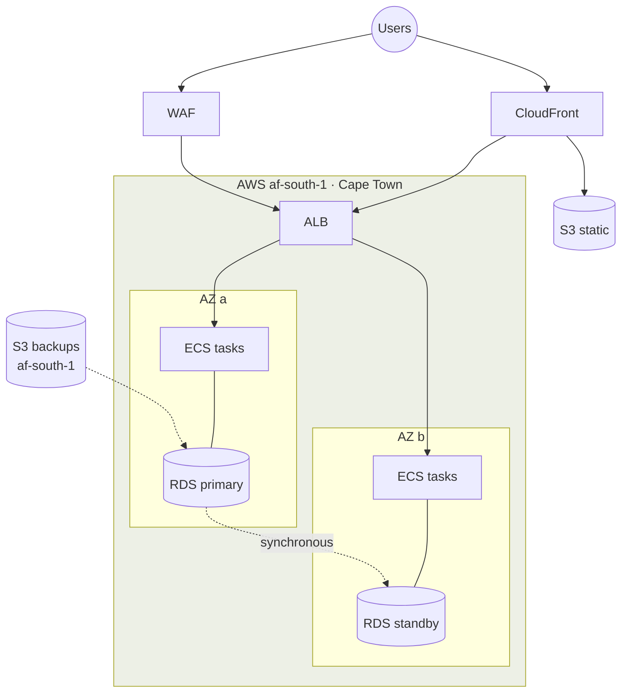

# Software Architecture

> **Implementation status (2026-08-07):** this document describes the accepted target architecture.
> Phase 2 implements the same domain-facing seam with durable browser-local stores; PowerSync,
> SQLite/OPFS replication and the production AWS topology are Phase 3+ work. Treating this diagram
> as already deployed hides the largest remaining architectural slice.

---

## 1. The shape of the problem

Four constraints determine this architecture. Everything else is a detail.

1. **The client must work with the network off, indefinitely.** Not degrade — work. This inverts the normal web architecture: the local database is the source of truth for the user, and the server is a replication peer, not an authority.
2. **Some operations cannot be trusted to a client.** Payroll computed against a stale rate table is a legal document that is wrong. There must be a server-authoritative path alongside the sync path.
3. **Personal data stays in South Africa.** No managed BaaS offers a South African region. We self-host.
4. **One country now, more later.** v1 is locked to `ZA` — the localisation is the moat. But every regulated rule sits behind an interface and every regulated row carries a `jurisdiction`, so the second country is a directory and a registry entry, not a rewrite. We build the **seam**, not the abstraction. [ADR-0006](adr/ADR-0006-multi-jurisdiction.md)

The architecture is the smallest thing that satisfies all three.

---

## 2. System context



Every external system is **optional**. Cut any one and the product still works — that is a deliberate constraint, because a farm system that breaks when a third party has an outage is not a farm system.

---

## 3. Containers



### Two paths to the server, and why

This is the load-bearing idea in the architecture.

| | Sync path | API path |
|---|---|---|
| Transport | PowerSync protocol | REST/JSON |
| Data | Operational records: animals, events, blocks, attendance | Computed & authoritative: payroll, PDFs, integrations |
| Offline | **Always available** | Unavailable, and says so |
| Latency to user | Zero (local write) | Network round trip |
| Authority | Client optimistic, server reconciles | Server only |
| Examples | Record a calving, a weight, a spray | Run payroll, generate an evidence pack, import from Stud Book |

**Why not one path?** Because the two have opposite requirements. Capture must never block on the network; payroll must never run on stale rates. Forcing one mechanism to do both means either payroll becomes unreliable or capture becomes online-only. Both failures kill the product.

**Why not two databases?** Both paths write the same Postgres. PowerSync replicates *from* Postgres via logical replication and routes client writes *back through* the API (`writeCheckpoint`), so business rules and RLS apply to every write regardless of path. There is one source of truth on the server; there are two ways to reach it.

---

## 4. Stack

| Layer | Choice | Why this, not the obvious alternative |
|---|---|---|
| Client | React 19 + TypeScript + Vite | Team-legible, Claude-Code-legible, boring. Not SvelteKit — this codebase will outlive our enthusiasm. |
| PWA | `vite-plugin-pwa` (Workbox) | The install and app-shell story is solved. Don't hand-roll a service worker. |
| Local DB | **SQLite (WASM) via PowerSync web SDK, OPFS** | Not IndexedDB/Dexie: we need real SQL (joins across animals × events × camps) and real transactions. Not RxDB: PowerSync's offline story is more complete. See [ADR-0003](adr/ADR-0003-sync-engine.md). |
| Sync | **PowerSync, self-hosted** | The only pluggable Postgres sync engine with first-class *offline* support (ElectricSQL and Zero are local-first but not offline-first). Sync Streams went GA May 2026. Self-hostable → af-south-1. |
| Server state | TanStack Query | Only for the API path. Sync-path data comes from PowerSync watched queries. |
| Styling | Tailwind + `@werf/ui` tokens | Core utilities only. No arbitrary values. |
| API | **NestJS** | Modules, DI, guards, interceptors, generated OpenAPI, first-class testing. Verbose, and the verbosity is why a small team can still read it in year three. Not Express — we would rebuild NestJS badly. |
| ORM | **Drizzle** | SQL-first, real PostGIS support, migrations that are readable diffs. Prisma's PostGIS story is `Unsupported()` — a non-starter when boundaries are a core entity. |
| DB | **Postgres 16 + PostGIS** | PostGIS is required (camps, blocks, GPS). RDS Multi-AZ in af-south-1. |
| Queue | BullMQ + Redis | PDFs, exports, imports, the scheduled compliance jobs. |
| Objects | S3 (af-south-1) | Photos, generated packs. Presigned, direct-from-client upload. |
| Auth | Custom JWT in the API | Not Auth0/Clerk: offline sessions (30-day) and per-farm RBAC are not their model, and the data must stay in SA. |
| Monorepo | pnpm workspaces + Turborepo | |
| Tests | Vitest · Playwright · Testcontainers | Real Postgres in tests. Never mock the database. |
| IaC | Terraform | |

### Repo layout

```
werf/
├── apps/
│   ├── web/                 # React PWA
│   ├── api/                 # NestJS
│   └── worker/              # BullMQ consumers
├── packages/
│   ├── core/                # ⭐ Zod schemas, domain types, Money, errors
│   │                        #    JURISDICTION-NEUTRAL. No `bceaThreshold` here.
│   ├── domain/              # ⭐ Pure business logic: payroll, compliance, conflict
│   │   ├── payroll/
│   │   │   ├── index.ts             # registry: { ZA: zaPayrollRules }
│   │   │   └── jurisdictions/za/    # ⭐ BCEA, SD13, NMW, UIF live HERE. Only here.
│   │   └── compliance/
│   │       └── jurisdictions/za/    # Animal ID Act, Stock Theft Act, GlobalGAP, SIZA
│   ├── db/                  # Drizzle schema, migrations, RLS policies
│   ├── sync/                # PowerSync sync rules + tenancy tests
│   ├── ui/                  # Design system
│   └── i18n/                # en-ZA, af-ZA, terminology tables
├── infra/                   # Terraform
├── docs/                    # this pack
└── .claude/                 # agents, rules, skills, hooks
```

**`packages/domain` has no I/O.** No database, no HTTP, no clock — the current date is injected. That is what makes payroll and compliance testable as pure functions against table-driven fixtures, which is the only way to have confidence in rules that carry legal weight. If you find yourself importing Drizzle into `domain/`, the design has gone wrong.

**`packages/core` is the contract.** Zod schemas there are the single source of truth for validation, and TypeScript types are derived with `z.infer`. Client and server validate with the identical schema object. A hand-written type that duplicates a schema is a bug waiting for a mismatch.

---

## 5. Data flow: a write, offline

```mermaid
sequenceDiagram
    actor U as Manager, in a camp
    participant UI as React
    participant PS as PowerSync SDK
    participant DB as Local SQLite
    participant Q as Upload queue
    participant S as PowerSync Service
    participant A as API
    participant PG as Postgres

    Note over U,DB: 📵 No signal
    U->>UI: Record calving
    UI->>UI: Validate (Zod, @werf/core)
    UI->>PS: insert event + animal
    PS->>DB: BEGIN; INSERT; INSERT; COMMIT
    DB-->>PS: ok (<50ms)
    PS->>Q: enqueue, durable
    PS-->>UI: watched query fires
    UI-->>U: Calf visible. "1 to send"

    Note over U,PG: 📶 Signal returns, 6 days later
    PS->>S: connect, auth (JWT)
    PS->>S: upload queue, occurred_at order
    S->>A: apply writes (business rules + RLS)
    A->>PG: INSERT ... RETURNING
    PG-->>A: ok
    A-->>S: write checkpoint
    S->>PG: read changes since client checkpoint
    S-->>PS: deltas
    PS->>DB: apply
    PS-->>UI: "Synced"
```

Two things to notice. **The user's turnaround is under 50ms and never touches the network.** And **client writes still go through the API**, so RLS and business rules are applied to a write that was composed six days ago on a phone in a camp — the client's optimism is never the server's trust.

---

## 6. Tenancy — three layers, and why



Every table with a `farm_id` has:

1. **A PowerSync sync rule** — decides what data is replicated to which device.
2. **An API guard** — decides what the server will do on request.
3. **A Postgres RLS policy** — the backstop.

**These are three separate systems that must agree, and this is the most dangerous thing in the architecture.** Sync rules are not RLS. A permissive sync rule leaks farm B's animals onto farm A's phone even when the RLS policy is perfectly correct, because replication does not go through PostgREST. The failure is silent.

Mitigation: `packages/sync/test/tenancy.spec.ts` asserts, for every table, that the sync rule and the RLS policy grant the same set. It runs in CI. It has caught this twice in the design phase already, on paper.

---

## 7. Deployment



**Everything containing personal information is in af-south-1.** CloudFront serves static assets globally — those contain no personal data, by construction. Backups stay in-region. Sentry is offshore, which is exactly why PII scrubbing is a code requirement (NFR-212) and not a settings checkbox.

Full detail: [deployment-guide.md](../05-operations/deployment-guide.md).

---

## 8. Decisions

| ADR | Decision | Status |
|---|---|---|
| [0001](adr/ADR-0001-pwa-over-native.md) | PWA, not native | Accepted |
| [0002](adr/ADR-0002-data-residency.md) | Self-host in af-south-1; not Supabase Cloud | Accepted · amended by 0006 |
| [0003](adr/ADR-0003-sync-engine.md) | PowerSync, not RxDB/Electric/custom | Accepted |
| [0004](adr/ADR-0004-enterprise-model.md) | One shared schema + validated JSONB, not per-species tables | Accepted |
| [0005](adr/ADR-0005-regulatory-rates.md) | Regulated values are data with effective dates | Accepted · amended by 0006 |
| [0006](adr/ADR-0006-multi-jurisdiction.md) | SA-locked, jurisdiction-ready. Seams, not abstractions | Accepted |
| [0007](adr/ADR-0007-authentication.md) | Passkeys + TOTP. Never SMS as a second factor | Accepted |

---

## 9. What will hurt

Named honestly, because the alternative is finding out in month nine.

| Risk | Why | What we do about it |
|---|---|---|
| **PowerSync is a dependency with a company behind it** | Vendor risk on the most load-bearing component | Self-hosted; the sync service is source-available; the client abstraction in `packages/sync` is thin enough to swap. Documented exit in [ADR-0003](adr/ADR-0003-sync-engine.md). |
| **Sync rules ↔ RLS drift** | Two systems, one invariant, silent failure | The tenancy test suite. It is not optional and it is not allowed to be skipped. |
| **PostGIS does not sync** | SQLite has no PostGIS | Canonical `geometry` in Postgres for spatial queries; denormalised GeoJSON `text` for the client. Both. Always. Documented in CLAUDE.md because it will be forgotten. |
| **OPFS quota on iOS** | Safari evicts under storage pressure | Retention window on the client (default 24 months); graceful degradation; the upload queue is never evicted. |
| **af-south-1 is a small region** | Fewer services, occasional feature lag | Terraform is portable; the exit is Azure South Africa North. |
| **Payroll correctness** | Legal exposure | Pure functions, table-driven tests against gazetted worked examples, external labour-law review before Phase 5 ships. |
| **Regulated values going stale** | The March deadline is set by the Minister | Rates as data ([ADR-0005](adr/ADR-0005-regulatory-rates.md)), a scheduled annual job with an owner, and a lint rule against constants. |
| **The jurisdiction seam is the wrong seam** | An interface with one implementation is a guess until the second one arrives | Accepted, knowingly. If we are wrong the cost is one indirection and an unused column — a cheap wrong. [ADR-0006](adr/ADR-0006-multi-jurisdiction.md) explains why this is the narrow case where YAGNI does not apply. |
| **`bceaThreshold` appears in `packages/core`** | It is the natural thing to type when SA is your only country | Review + the compliance-checker subagent. **No lint rule catches this**, which is why it is called out in three documents. |

The last one is the one that actually kills products in this market. It is a calendar problem disguised as an engineering problem, which is why it appears in the architecture document at all.
