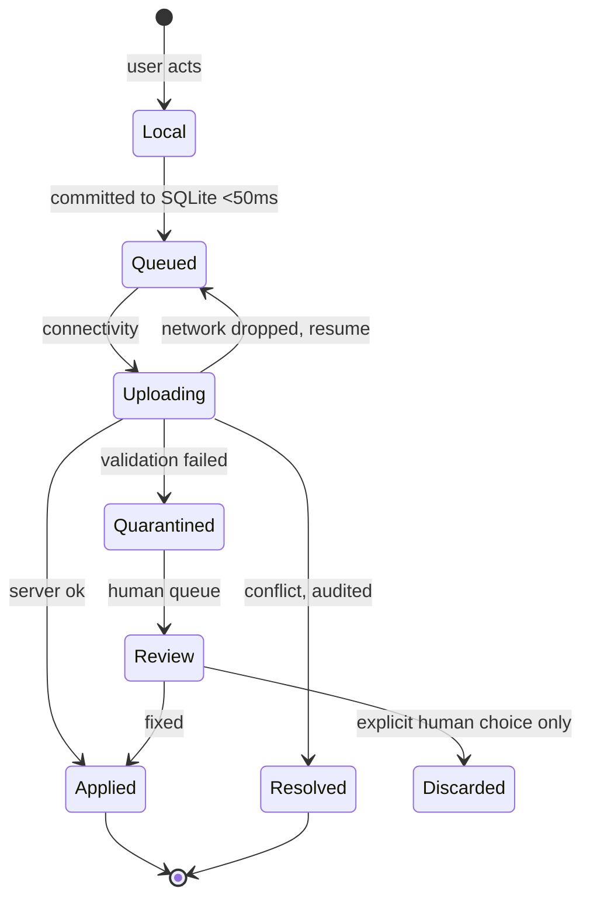

# Offline & Sync Design

**This is the highest-risk document in the pack.** Every other subsystem can be rebuilt in a sprint. Get sync wrong and you lose a farmer's data once, and that farmer tells every farmer at the co-op, and they are right to.

Read this before touching anything in `packages/sync`.

> **Implementation status (2026-08-07):** Phase 2 has durable browser-local capture stores and an
> explicit outbox behind `@werf/sync`. It does not yet have the PowerSync SDK, SQLite/OPFS domain
> tables or cross-device replication described below. Phase 3 implements this contract and migrates
> existing queued captures; the document is normative design, not a claim that the engine is live.

---

## 1. The premise

> **Offline is the normal operating state. Online is the exception during which we reconcile.**

This inverts the usual mental model, and the inversion has to be real, not rhetorical. Concretely:

- The local SQLite database **is** the source of truth for the user. Not a cache. Not a mirror. The truth.
- A write is **done** when it commits locally (<50ms). Not when it reaches the server.
- The network is a background reconciliation process the user must never think about.
- `if (!navigator.onLine)` appearing anywhere in a write path is a **bug**, not a guard clause.

If any of these feel uncomfortable, the discomfort is the point. A farmer in a camp on the Free State highveld has no signal for hours at a time, and they are not going to stop calving because we designed for wifi.

---

## 2. The three timestamps

Everything downstream depends on getting this right, and it is the mistake that will be made if it is not stated bluntly.

| Column | Meaning | Set by | Used for |
|---|---|---|---|
| `occurred_at` | **When it happened on the farm** | The user (defaults to now, editable) | **Every report. Every calculation. Every rate lookup.** |
| `created_at` | When the row was written to local SQLite | The client | Debugging, audit |
| `synced_at` | When it reached the server | The server | Sync diagnostics |

They differ by **weeks**. A manager records a calving on 1 March, stays offline through lambing, and syncs on 8 March.

- The March calving report must show it on **1 March**.
- Conflict resolution must order it by **1 March**.
- The wage rate for a shift on 27 February must be **February's rate**, resolved by `occurred_at`, even though the row arrived in March.

**The bug this prevents:** using `created_at` or `now()` for reports puts a March calving in the April report, and using `now()` for rate lookup pays February work at March's wage. Both are silent. Both are wrong. Both will happen if this section is not read.

---

## 3. What syncs, what does not

| Class | Tables | Direction | Why |
|---|---|---|---|
| **Full** | `animals`, `animal_identifiers`, `mobs`, `land_units`, `events`, `enterprises`, `branding_registers` | ↕ | This is the farm. It must work offline. |
| **Reference** | `chemical_products`, `veterinary_products`, `regulatory_rates`, `notifiable_diseases`, `public_holidays` | ↓ read-only | **The PHI and withdrawal checks must work in the crush.** Without this on the device, US-032 and UC-010 are impossible. |
| **Filtered** | `employees` (minus encrypted columns), attendance events | ↕ role-gated | Attendance is captured in the field; ID numbers and banking are not. |
| **Never** | `payroll_runs`, `payslips`, `financial_transactions`, `injury_records`, `audit_log`, `compliance_items` | ✗ | Money, health, audit. A stolen phone must not contain 40 workers' payslips (NFR-215). |

**The retention window.** A farm with 50,000 animals and ten years of events will not fit in OPFS on a mid-range phone. Sync rules bound the client to a rolling window (default 24 UTC calendar-month buckets of events; all live animals; all reference data). The window is configurable per farm through `farms.event_retention_months` and degrades the *read* set only — **the write queue is never bounded and never evicted.** PowerSync cannot compare a row timestamp to a moving parameter with `>`/`<`, so the event stream uses its documented equality-bucket workaround: one authorised `(farm_id, YYYY-MM)` subscription per retained month. The client subscribes the new month before releasing the oldest with TTL 0; queue rows live in separate local-only tables and are untouched.

### 3.1 Attachment blobs are local facts before they are objects

Approved for Phase 3 on 2026-08-08: animal photos and every later document use one attachment
pipeline. The metadata is a normal farm-scoped, client-UUIDv7, soft-deleted sync row; the binary is
written to OPFS before capture reports success. The network is not in that commit path.

The binary queue has the same durability rule as the write queue: it is never evicted while pending.
A browser restart resumes it; quota pressure may evict replaceable read data, never an unacknowledged
blob. Upload is idempotent by attachment id and checksum. A successful HTTP upload alone is not an
acknowledgement—the server must durably finalise matching size/checksum metadata before the device
may release its local binary.

The API first authorises membership of the attachment's `farm_id`, then issues a short-lived
presigned request for a server-derived object key. Clients never choose bucket paths and never store
presigned URLs. Production objects stay in S3 `af-south-1`; development and integration tests use
MinIO through the same S3-compatible adapter. Cross-farm upload/read attempts, checksum mismatch,
retry after an ambiguous response, browser kill, migration and quota pressure are required tests.

---

## 4. Conflict resolution

Four rules. Which one applies is a property of the table, declared in `packages/sync/rules.ts` and tested.

### Rule 1 · Field-level last-write-wins (default)

Two devices edit different fields of the same animal → **both survive**. Merge per field, not per row.

Two devices edit the *same* field → the later `occurred_at` wins; `updated_at` breaks ties. **An audit row is always written.**

```ts
// packages/domain/sync/resolve.ts
export function resolveFieldConflict<T>(
  local: Versioned<T>, remote: Versioned<T>, field: keyof T
): Resolution<T> {
  const lt = local.occurredAt ?? local.updatedAt;
  const rt = remote.occurredAt ?? remote.updatedAt;
  const winner = rt > lt ? remote : local;
  return {
    value: winner[field],
    audit: {
      action: 'conflict_resolved', rule: 'field_lww', field,
      localValue: local[field], remoteValue: remote[field],
      localAt: lt, remoteAt: rt, chose: winner === remote ? 'remote' : 'local',
    },
  };
}
```

### Rule 2 · Append-only events are never merged

Two devices record what is probably the same real-world birth → **two rows exist**. A `possible_duplicate` review item is raised. Neither is deleted. A human decides.

**Why not auto-merge?** Because we cannot know. Two calving records for the same dam within an hour might be a double-entry — or twins. Auto-merging destroys a real calf; auto-keeping-both inflates the count until someone looks. Only one of those is recoverable.

Heuristic for raising the review item (tuned, not clever): same `type` + same `animal_id`/`mob_id` + `occurred_at` within a species-specific window + similar payload.

### Rule 3 · State machines, not values

`animals.status` is not a field. It is a state with precedence:

```
dead > sold > culled > missing > alive
```

Device A records a sale at 14:00. Device B records a death at 10:00. **Result: `dead`.** The sale is flagged for review, not deleted, and an audit row explains the rule.

This looks like a bug and is not. An animal that died cannot have been sold; the sale is almost certainly a mis-keyed tag. But we do not *know* that — so we resolve the status deterministically and hand the contradiction to a human, who has the context we lack.

### Rule 4 · Server-authoritative

`payroll_runs`, `payslips`, `financial_transactions` never sync (§3). The client cannot conflict with what it never holds.

### The rule above the rules

> **No conflict is ever resolved silently.** Every resolution writes an `audit_log` row with both values, the rule applied, and the winner. If a farmer asks "why does it say Camp 5 when I put her in Camp 3", the answer is in the database.

---

## 5. The write queue



**Invariants. These are not aspirations.**

1. A queued write survives app close, browser kill, and device reboot. Tested by chaos test, not by hope.
2. A queued write is **never** discarded by the system. Only a human, explicitly, after review.
3. ⛔ **The queue does NOT drain in `occurred_at` order, and must not.** It drains in an order
   that puts the EVIDENCE a server-side guard reads ahead of the thing that guard judges. This
   invariant used to read "drains in `occurred_at` order"; that was never what the code did and it
   is the shape of a SEV-1 this repo has already shipped and fixed. The rules, in the order the
   flush applies them (`apps/web/src/sync/Outbox.tsx`):
   1. **The foreign-key graph first** — a row cannot insert before the row it references.
   2. **Evidence before the act it is judged against.** A dose creates a withholding; a move
      decides which mob an animal stood in. Both must reach the server BEFORE any disposal
      (`sale`, `slaughter`) that the server's withdrawal guard will judge against them. The guard
      is a point-in-time query and cannot refuse what it has not received: dip a flock Monday
      offline, tally forty to the abattoir Tuesday, reconnect Friday, and an `occurred_at` drain
      posts the tally first and gets a **201** for meat inside an active withholding.
   3. **Capture order for everything else, because capture order is CAUSAL.** It is what makes a
      departure precede its own arrival and an increase precede the departure it funds. The sort
      is stable, so what is left is the farmer's own order.
   4. ⛔ **A departure is pulled forward only to just before its OWN arrival — never to the front.**
      Hoisting every departure breaks a chained move A→B→C: `out_B` posts before `in_B` has landed,
      the server sees no head in B, and refuses a valid capture. That refusal is worse than a
      retry, because `/not-sent` tells the farmer to record it again and a recount RESETS.
   5. **A refused or held capture taints what depends on it.** An item declares `provides` for what
      it establishes and `guardedBy` for what it needs; anything whose subject was tainted this
      round is HELD (pending, not refused), so it cannot reach a server that never heard of the
      thing it depended on. Three namespaces, and they are deliberately disjoint: bare animal/mob
      ids for a **withholding**, a batch id for the **two halves of a move**, `mobrow:<id>` for the
      **mob row itself**. Sharing one namespace across two questions is how a fix for a false pass
      became a false refusal — see 6.
   6. ⛔ **Head availability is ARITHMETIC, not a subject.** A decrease is held only when the
      device's own fold — `projectHeadCount` over the baseline and the captures the server actually
      holds, cut at `(occurred_at, id)` — says the server would refuse it. This is the same
      projection `deriveHeadCount` runs, so the two sides cannot disagree **as long as the device
      holds the whole log**. ⛔ That qualifier is load-bearing and is not yet true by construction:
      "the captures the server actually holds" is really "the captures this device sent", and the
      two part company the moment Phase 3 hydrates from the server. See the 3e hydration tripwire
      in `phase-checklists.md` — under-counting there holds a valid decrease for ever. It was briefly a
      `head:<mobId>` subject, which held any decrease whenever any increase on that mob was tainted:
      three deaths in a camp of a hundred, stranded for ever behind an unrelated refused purchase.
   7. **A held capture is REPORTED.** `/not-sent` lists it under "waiting on one of the above" and
      the strip counts it in the pending total. A hold nobody can see is a lost record — the strip
      used to return early on the refusal count, so three held captures read as "1 not sent".

   `occurred_at` remains what REPORTS are ordered by, and the total order for any projection is
   `(occurred_at, id)` on both sides. Neither is the send order.
4. A dropped connection resumes from the last acknowledged checkpoint. **Never restarts.** On EDGE, a restart means it never completes.
5. **An expired refresh token holds the queue; it does not clear it.** (UC-050 A2.1)
6. The queue is never evicted for storage pressure. Degrade the read set instead.

Invariant 5 is a two-line mistake that destroys a month of a farmer's work. It gets its own test.

---

## 6. Schema migration with clients in the past

The hardest problem here, and the one most likely to be discovered too late.

**The scenario:** a farmer syncs on 1 March. We deploy a migration on 5 March. They sync again on 20 April with six weeks of writes composed against the old schema.

**The rules:**

1. **Additive only, always.** Add a column, backfill, switch reads, drop the old one *at least two releases later*.
2. **Never rename in one step.** Add → dual-write → backfill → switch reads → drop.
3. **Never tighten a constraint in the same release that starts enforcing it.** The old client does not know about it and its queued writes will fail validation.
4. **The server accepts writes from any client version within the support window** (12 months, per [api-specification.md §11](api-specification.md)).
5. **A write that cannot be applied is quarantined, never rejected.** It goes to a review queue with full context. (UC-050 E4.2)

> The temptation, always, is to ship a clean migration and let old clients catch up. There are no old clients. There are *farmers*, and one of them has six weeks of lambing records on a phone in a bakkie.

---

## 7. Testing

**The offline suite is not optional and it does not get skipped.** Full matrix in [testing-strategy.md](../04-delivery/testing-strategy.md); the load-bearing ones:

| Test | Asserts |
|---|---|
| Write offline → kill browser → reopen offline | Record present, still queued |
| Write offline → reboot device → reopen | Record present |
| Write offline × 6 weeks → sync | All applied, `occurred_at` preserved, reports use `occurred_at` |
| Kill connection mid-upload | Resumes from checkpoint, no duplicate, no loss |
| Two devices, different fields | Both survive, no audit row |
| Two devices, same field | Later `occurred_at` wins, audit row written |
| Two devices, same birth | Two rows + review item, nothing deleted |
| Sale vs death | `dead`, sale flagged, audit row |
| **Refresh token expires with 47 queued writes** | **Queue held, uploaded after login** |
| Storage quota exceeded | Read set degrades, **queue intact** |
| Old client writes against new schema | Applied or quarantined, never lost |
| Permissive sync rule + correct RLS | **Tenancy test FAILS loudly** |

The last one is a test we write against ourselves. Sync rules and RLS are two systems enforcing one invariant, and the failure mode is silent cross-tenant leakage. The test makes it loud.

---

## 8. The things that will actually go wrong

| | Why | Response |
|---|---|---|
| **Sync rules drift from RLS** | Two languages, one invariant, silent failure | `packages/sync/test/tenancy.spec.ts` in CI, per table, no skip |
| **Someone uses `created_at` in a report** | It looks right and is wrong by weeks | Lint rule + review + CLAUDE.md |
| **Someone calls `rates.lookup(code, new Date())`** | Pays February work at March's rate | Lint rule + PR rejection ([ADR-0005](adr/ADR-0005-regulatory-rates.md)) |
| **OPFS eviction on iOS** | Safari evicts under storage pressure | Retention window; queue never evicted; warn early |
| **WAL growth on an idle Postgres** | Logical replication on a quiet database has a known disk-fill footgun | Monitor replication slot lag; alert on WAL size; documented in [monitoring-logging.md](../05-operations/monitoring-logging.md) |
| **Clock skew on a cheap phone** | `occurred_at` from a device whose clock is wrong by hours | Server records `synced_at`; flag writes where `occurred_at > synced_at + tolerance`; **never silently correct** — the farmer may have back-dated deliberately |
| **PostGIS forgotten in a new table** | SQLite has no PostGIS; the column silently does not sync | Convention + review + the trigger pattern in [database-schema.md §3](database-schema.md) |
| **Sync failures are invisible** | The farmer thinks it saved — and locally it did. The failure is ours | Per-farm sync health dashboard (NFR-710). Watch it. |

That last row is the one that hurts most and is easiest to miss. Sync is silent when it works and silent when it fails. If we do not watch queue depth and failure rate **per farm**, we find out about problems when a customer calls, having lost a week — and by then the trust is gone regardless of whether we recover the data.

---

## 9. Copy — how we talk about this to farmers

The word "sync" never appears in the UI. It is our word for our problem. The farmer's question is *"is my work safe?"*, and the answer must be in their words.

| State | What we say | Never say |
|---|---|---|
| Offline, queued | **"Offline — your work is saved"** | "No connection" · "Sync pending" |
| Uploading | "Sending 3 of 12" | "Syncing…" |
| Done | "Saved. Sent 12." | "Sync complete" |
| Conflict | "2 records need your attention" | "Merge conflict" |
| Quarantined | "1 record couldn't be sent. It's still here. [Review]" | "Validation error" |

**"Offline — your work is saved" is doing the most important job in this product.** A farmer who is not certain their entry survived will write it on paper as well. The moment they keep a paper backup, we have lost — because now the app is extra work rather than less, and it will be abandoned within a month, correctly.
