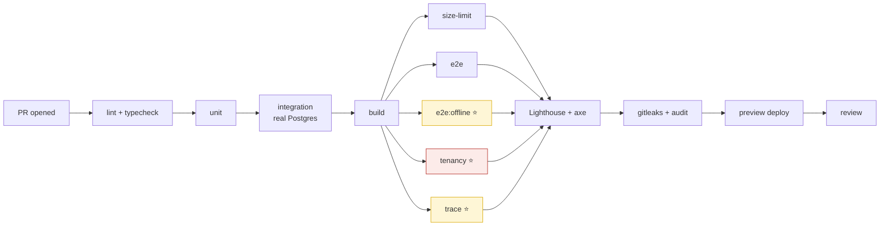

# CI/CD

**CI is where `pnpm verify` becomes non-negotiable.** Everything in the [Claude Code playbook](claude-code-playbook.md) depends on the gate being real — a check that can be skipped is not a gate, it is a suggestion, and Claude Code will eventually find the skip.

> **⚠️ The workflows below are the TARGET design, not what `.github/workflows/ci.yml` contains today.**
> As of 2026-08-16 (Q18, STATUS.md §5 item 39) CI has **three** real lanes: `verify` (lint,
> typecheck, test, build — build now includes the real `check-bundle-size.mjs` gate, NFR-009),
> `e2e` (axe-core, both themes, NFR-401), and `dependency-audit` (`pnpm audit --audit-level=critical
> --prod`, NFR-208). All have run green locally; draft PR #3 opened 2026-07-26 and CI ran on every
> push through Phase 2 (STATUS.md §4 A4, G5 — G5 is CLOSED). The underlying fact that G5 recorded
> still holds and is worth keeping: **CI does not run on a feature branch with no PR**, so "green
> locally" stays unproven until one exists — open the draft PR early in a phase, not at the end.
> Everything else in this file below — Lighthouse, size-limit-the-package (the real gate is a
> hand-written script), coverage thresholds, the `tenancy`/`trace`/`budgets` jobs as separate
> lanes — is still the TARGET, not the YAML (`pnpm test:tenancy` is not a script; the check runs
> inside `pnpm test` as `packages/sync/test/tenancy.spec.ts`; `pnpm test:trace` is **report-only**,
> phase-aware as of this session, and exits 0 regardless — see
> [non-functional-requirements.md](../01-requirements/non-functional-requirements.md) for the
> full real-vs-target accounting). Treat every other job here as a plan until it is in the YAML,
> and when you add one, delete the corresponding part of this warning.

---

## 1. Environments

| | Purpose | Data | Deploys | Region |
|---|---|---|---|---|
| **local** | Development | Seeded (3 farms: livestock, crop, mixed) | `pnpm dev` | laptop |
| **preview** | One per PR | Seeded, ephemeral | Automatic on PR | af-south-1 |
| **staging** | Pre-production | **Anonymised** production shape | Automatic on merge to `main` | af-south-1 |
| **production** | The farms | Real | **Manual approval** | af-south-1 |

**Staging data is anonymised, not copied.** A staging environment holding real workers' ID numbers is a POPIA breach waiting for a misconfigured security group. The anonymiser runs as part of the refresh and is itself tested — see [maintenance-runbook.md](../05-operations/maintenance-runbook.md).

**Preview environments are ephemeral and destroyed on PR close.** They cost money and they accumulate.

---

## 2. The PR pipeline



```yaml
# .github/workflows/pr.yml
name: PR
on: pull_request

concurrency:
  group: pr-${{ github.event.pull_request.number }}
  cancel-in-progress: true

jobs:
  verify:
    runs-on: ubuntu-latest
    timeout-minutes: 15
    steps:
      - uses: actions/checkout@v4
      - uses: pnpm/action-setup@v4
      - uses: actions/setup-node@v4
        with: { node-version: 22, cache: pnpm }
      - run: pnpm install --frozen-lockfile
      - run: pnpm verify              # lint + typecheck + test + build

  offline:                            # ⭐ the product thesis, tested
    runs-on: ubuntu-latest
    timeout-minutes: 20
    steps:
      - uses: actions/checkout@v4
      - uses: pnpm/action-setup@v4
      - run: pnpm install --frozen-lockfile
      - run: pnpm exec playwright install --with-deps chromium
      - run: pnpm test:e2e:offline
      - uses: actions/upload-artifact@v4
        if: failure()
        with: { name: offline-traces, path: test-results/ }

  tenancy:                            # ⭐ the security boundary
    runs-on: ubuntu-latest
    steps:
      - uses: actions/checkout@v4
      - uses: pnpm/action-setup@v4
      - run: pnpm install --frozen-lockfile
      - run: pnpm test:tenancy

  trace:                              # ⭐ no P1/P2 FR without a test
    runs-on: ubuntu-latest
    steps:
      - uses: actions/checkout@v4
      - uses: pnpm/action-setup@v4
      - run: pnpm install --frozen-lockfile
      - run: pnpm test:trace

  budgets:
    runs-on: ubuntu-latest
    steps:
      - uses: actions/checkout@v4
      - uses: pnpm/action-setup@v4
      - run: pnpm install --frozen-lockfile
      - run: pnpm build
      - run: pnpm exec size-limit            # 250KB gz — FAILS the build
      - run: pnpm exec lhci autorun          # perf ≥90, a11y 100

  security:
    runs-on: ubuntu-latest
    steps:
      - uses: actions/checkout@v4
        with: { fetch-depth: 0 }
      - uses: gitleaks/gitleaks-action@v2
      - run: pnpm audit --audit-level=critical
```

**Jobs run in parallel and every one is required.** `offline`, `tenancy`, and `trace` are separate jobs rather than folded into `verify` for one reason: when they fail, the failure should be legible at a glance in the PR checks list. "verify failed" tells you nothing; "offline failed" tells you the thing that matters most is broken.

---

## 3. The gates

Every one of these **fails the build**. None warns.

| Gate | Threshold | Source |
|---|---|---|
| Type errors | 0 | NFR-503 |
| Lint errors | 0 | |
| **Regulated constants** | **0** | **NFR-507** 🇿🇦 |
| Domain coverage | ≥90% (payroll/compliance/sync ≥95%) | NFR-501 |
| Overall coverage | ≥75% | NFR-502 |
| Initial bundle | ≤250KB gz | NFR-009 |
| Lighthouse performance | ≥90 | NFR-001…006 |
| Lighthouse accessibility | 100 | NFR-401 |
| `axe-core` violations | 0 | NFR-401 |
| Critical CVEs | 0 | NFR-208 |
| Secrets detected | 0 | NFR-207 |
| Uncovered P1/P2 FR | 0 | testing-strategy §6 |
| **Offline suite** | **all green** | **NFR-101** |
| **Tenancy suite** | **all green** | **NFR-206** |

**On the temptation to make one of these a warning:** it will happen, and it will happen on a Friday when a release is blocked by a 251KB bundle. The correct response is to fix the bundle. A gate downgraded to a warning is a gate deleted, because nobody reads warnings — and the bundle is 340KB three months later and the app takes eleven seconds to load on the phone your customers actually own.

The escape hatch is a documented, time-boxed exception with an owner and an issue number. Not a config change.

---

## 4. Merge → staging

```yaml
# .github/workflows/main.yml
name: main
on:
  push: { branches: [main] }

jobs:
  deploy-staging:
    runs-on: ubuntu-latest
    environment: staging
    permissions: { id-token: write, contents: read }
    steps:
      - uses: actions/checkout@v4
      - uses: aws-actions/configure-aws-credentials@v4
        with:
          role-to-assume: ${{ secrets.AWS_ROLE_STAGING }}
          aws-region: af-south-1                     # ⭐ always
      - run: pnpm install --frozen-lockfile && pnpm build
      - name: Migrate
        run: pnpm db:migrate
        env: { DATABASE_URL: ${{ secrets.STAGING_DATABASE_URL }} }
      - name: Push images
        run: |
          docker build -t $ECR/api:${{ github.sha }} -f apps/api/Dockerfile .
          docker build -t $ECR/worker:${{ github.sha }} -f apps/worker/Dockerfile .
          docker push $ECR/api:${{ github.sha }}
          docker push $ECR/worker:${{ github.sha }}
      - name: Deploy
        run: aws ecs update-service --cluster werf-staging --service api \
             --force-new-deployment
      - name: Static
        run: |
          aws s3 sync apps/web/dist s3://werf-staging-web --delete
          aws cloudfront create-invalidation --distribution-id $CF_ID --paths "/*"
      - name: Smoke
        run: pnpm test:smoke --base-url https://staging.werf.co.za
```

**OIDC, not access keys.** `id-token: write` and an assumed role. A long-lived AWS key in GitHub secrets is a credential that outlives everyone who knew it existed.

---

## 5. Production release

Manual. Deliberately.

```yaml
# .github/workflows/release.yml
name: release
on:
  workflow_dispatch:
    inputs:
      sha: { description: 'Commit SHA (must be green on staging)', required: true }

jobs:
  release:
    runs-on: ubuntu-latest
    environment: production        # ⭐ requires a human approval in GitHub
    steps:
      - uses: actions/checkout@v4
        with: { ref: ${{ inputs.sha }} }

      - name: Verify this SHA passed staging
        run: ./scripts/assert-staging-green.sh ${{ inputs.sha }}

      - name: Backup before migration
        run: aws rds create-db-snapshot --db-snapshot-identifier pre-${{ inputs.sha }} ...

      - name: Migrate
        run: pnpm db:migrate
        env: { DATABASE_URL: ${{ secrets.PROD_DATABASE_URL }} }

      - name: Deploy (blue/green)
        run: aws deploy create-deployment --deployment-group-name werf-prod ...

      - name: Smoke
        run: pnpm test:smoke --base-url https://app.werf.co.za

      - name: Tag
        run: git tag release/$(date +%Y-%m-%d)-${{ inputs.sha }} && git push --tags
```

**Rules:**
- **Migrations run before the deploy, and they are additive-only.** The old code must run against the new schema for the duration of the rollout. ([database-schema.md §12](../03-architecture/database-schema.md))
- **Snapshot before every migration.** Non-negotiable. It costs 30 seconds.
- **Blue/green.** Rollback is a traffic shift, ≤5 min (NFR-708).
- **Never deploy on a Friday.** Never deploy in the week before 1 March. See §7.

---

## 6. Rollback

```bash
# Code: shift traffic back. Under 5 minutes.
aws deploy stop-deployment --deployment-id <id> --auto-rollback-enabled

# Static: previous build is still in S3, versioned
aws s3 sync s3://werf-web-releases/<previous-sha>/ s3://werf-prod-web --delete
aws cloudfront create-invalidation --distribution-id $CF_ID --paths "/*"
```

**Migrations do not roll back.** Roll forward. This is why additive-only is a rule and not a preference: a rollback of the *code* must be safe against the *migrated* schema, which is only true if the migration was additive.

**And the constraint that makes this harder than a normal web app:** a client offline for six weeks will sync against whatever schema is live. There is no "roll back and nobody notices" — somebody's phone is holding writes composed against a schema from two releases ago. Forward-only, additive-only, 12-month client support window ([api-specification.md §11](../03-architecture/api-specification.md)).

---

## 7. The release calendar 🇿🇦

This is where CI/CD meets South African labour law, and it is the part that surprises people.

| When | What | Why |
|---|---|---|
| **Early February** | Ship the new minimum wage rate | The Gazette lands ~3 weeks before 1 March. Miss it and **every farm underpays every worker from 1 March.** |
| **Late February** | **Change freeze on payroll code** | Verify a real run against a hand-calculation. Do not ship anything else near it. |
| **1 March** | New rate live. Watch the first runs. | |
| **Mid-April** | Ship the new BCEA threshold | Effective 1 May |
| **Nov–Dec** | Ship next year's public holidays | Including any once-off proclaimed days |

**The February deadline is set by a Minister, not by us.** It is the only release in the year with an external legal deadline, and missing it is the highest-severity non-outage incident this product can have. It goes in the on-call calendar in January.

The rate change itself is a `POST /v1/admin/regulatory-rates` — **not a deploy** ([ADR-0005](../03-architecture/adr/ADR-0005-regulatory-rates.md)). That is the entire point of the design. But the *verification* that it worked is a release-grade activity, and the change freeze exists so that a wage bug and an unrelated deploy cannot be confused with each other on 2 March.

---

## 8. Claude Code and CI

The gates in §3 are what make [`/goal`](claude-code-playbook.md) meaningful. A condition like:

```
/goal pnpm verify exits 0 and the offline suite passes
```

only works because those commands are facts. If `pnpm verify` passed while coverage was at 40%, the loop would terminate on a lie and Claude would report success on broken work.

**So: never weaken a gate to unblock a Claude Code session.** That inverts the relationship — the gate exists to constrain the loop, not the other way round. If a session cannot pass the gate, the correct outcomes are (a) the code is wrong, or (b) the gate is wrong and needs a human to change it deliberately, in a PR, with a reason. Not (c) turn it off.

The `.claude/hooks/verify-gate.sh` Stop hook runs the same `pnpm verify` locally that CI runs remotely. Same command, same threshold, no drift. If they diverge, the local one is lying.
