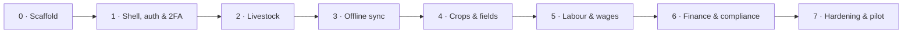

# Roadmap

> **Authority:** this document owns phase shape and scope. [`STATUS.md`](../../STATUS.md) owns the
> current branch, sequencing, verification evidence, and owner decisions. The executable detail for
> the active phase lives in [phase-checklists.md](phase-checklists.md). If those three disagree, stop
> and reconcile them before writing code.

Eight phases. Every phase ends with automated evidence and a human judgement that automation cannot
replace. A phase is not complete because its branch is large or its tests are numerous.

## Shape

The sequence is architectural, not cosmetic. Phase 2 proves local-first capture against a small
adapter. Phase 3 replaces that adapter with the intended PowerSync/SQLite replication layer before
another large offline domain is added. Payroll follows the two field domains so its compliance
engine is not built on temporary persistence.

## Phase 0 — Scaffold & repo hygiene

**Ships:** a public TypeScript monorepo where `pnpm verify` is meaningful and CI protects `main`.

**Gate:** repository scripts, secret scanning, authorship, tenancy foundations, documentation and CI
all agree; `pnpm verify` exits 0.

## Phase 1 — App shell, auth & 2FA

**Ships:** registration, enterprise-aware onboarding, farm switching, passkey/TOTP authentication,
an installable shell, and a session/theme/locale that survive a cold start without signal.

Phase 1 uses the `@werf/sync` adapter for local session and shell persistence. It does **not** claim
full domain replication through PowerSync; that belongs to Phase 3.

**Gate:** `pnpm verify`, browser e2e in both themes, offline cold start, bundle budget, auth and
tenancy tests. Human check: install on a real phone, use aeroplane mode, reboot, reopen.

## Phase 2 — Livestock

**Ships:** individual and mob livestock records, camps, append-only lifecycle and tally events,
health/withdrawal capture, breeding, rainfall, stock-theft records, and offline browser persistence.

| Slice | Content | Evidence |
|---|---|---|
| 2a | Animals, identifiers, mobs, camps, species attributes | FR-101…112 |
| 2b | Birth, death, move, sale/purchase, tally projections and batches | FR-102…112 |
| 2c | Weigh-session crush UX | US-050 |
| 2d | Treatment, vaccination, dip and meat/milk withdrawal | FR-130…133; offline guard |
| 2e | Mating, pregnancy and weaning | FR-120…123 |
| 2f | Branding, theft incident facts and evidence-pack foundation | FR-601…605 |

**Gate:** `pnpm verify`; `pnpm test:e2e`; Phase 2 checklist truthful; review findings closed; the
owner-triggered compliance pass clears regulated livestock, animal-ID and stock-theft logic. Human
check: a livestock farmer records work in the crush and can explain every count and warning.

**Not in this phase:** crop blocks, plantings, sprays, PHI and harvest. They are Phase 4. Object
storage is not implied by a `photo_key`; the owner assigned its shared local-first foundation to
Phase 3 on 2026-08-08.

## Phase 3 — Offline sync

**Ships:** the architecture ADR-0003/[ADR-0012](../03-architecture/adr/ADR-0012-upload-topology.md)
promise: React reads and writes local SQLite through the sync adapter; `Outbox.tsx` moves deltas UP
to Postgres via REST, PowerSync moves deltas DOWN from Postgres; RLS and sync rules agree; the
outbox survives old clients, retries and long offline periods without data loss. The same phase adds
the approved shared
attachment foundation: OPFS blobs, synced metadata, deferred S3-compatible uploads and tenant-safe
reads, with MinIO in development/tests and S3 in `af-south-1` in production.

| Slice | Content | Evidence |
|---|---|---|
| 3a | PowerSync web SDK behind `@werf/sync`; SQLite/OPFS schema | adapter contract tests |
| 3b | Farm-scoped sync rules matching Postgres RLS | cross-farm leak test fails loudly |
| 3c | Migrate Phase 2 local stores to SQLite without losing queued captures | upgrade/rollback tests |
| 3d | Durable upload queue: idempotency, 4xx quarantine, 5xx abort, refresh hold | offline matrix |
| 3e | Conflict rules and append-only projections ordered by `(occurred_at, id)` | two-device tests |
| 3f | Retention/read-set degradation; queue never evicted | quota test |
| 3g | Old-client compatibility and additive migrations | 24-month client-window test |
| 3h | Sync health/observability without PII | per-farm diagnostics |
| 3i | Shared local-first attachment queue and S3-compatible object boundary | offline/restart/quota, checksum, idempotency and cross-farm tests |

**Gate:** the required matrix in [testing-strategy.md](testing-strategy.md) passes against real
Postgres and the real sync adapter. A six-week offline write set reaches another device with every
`occurred_at` preserved; cross-farm data never does.

**Review discipline:** schema, RLS, sync-rule and write-path slices are reviewed individually when
the owner triggers the relevant reviewer/sync-auditor. Do not batch a Phase 3 tenancy change.

## Phase 4 — Crops & fields

**Ships:** crop blocks, plantings, fertiliser, spray capture, farmer-owned product data, advisory PHI
reminders, harvest, grazing/feed and the crop-facing home metrics—on the real Phase 3 sync layer.
Full slice detail (schema/API/screen/projection/tests per slice, and the corrected FR bucketing
below) is in `phase-checklists.md`'s Phase 4 section — authored at the start of this phase, not
speculatively.

| Slice | Content | Evidence |
|---|---|---|
| 4a | Blocks and plantings | FR-201, FR-202, FR-203 |
| 4b | Fertiliser (no compliance gate) | FR-206 |
| 4c | Farmer product catalogue, sprays, private spray-history report | FR-508, FR-204, FR-211 |
| 4d | Harvest + advisory PHI/re-entry reminders | FR-205, FR-207, US-030 offline |
| 4e | Grazing, feed and inventory (new schema) | FR-150…153, 501…503 |

Deferred (priority-2, not in this phase's "Ships" line): FR-208/209/210/212 (soil/leaf/fruit
analysis, scouting, rotation history, weather). The GlobalGAP checklist *engine* is Phase 6.

**Gate:** crop P1 requirements and US-030 pass offline; reminders use the farmer's recorded inputs;
a crop farmer can complete a spray-to-harvest record with no network and no compliance block.
No production `chemical_products` seed or maintained registration source is required (ADR-0013).

## Phase 5 — Labour & wages

**Ships:** employees, attendance, piece work, a pure payroll engine, compliance warnings, payslips,
contracts, leave and statutory exports.

The code may be developed against explicitly unverified dev/test rate rows. Production seeds and
deployment are blocked until every figure is re-verified against the current Gazette and the
external labour-law review is complete.

**Advisory, not blocking ([ADR-0014](../03-architecture/adr/ADR-0014-advisory-payroll.md), extending
ADR-0013 to labour, owner decision 2026-08-22).** Werf is a
logbook and a **calculator**, not an authority. Attendance and piece-work capture never block and
work offline. The payroll engine computes exactly — caps cap, the piece-rate floor tops up, a
net-below-floor run is detected — but surfaces every issue as a conspicuous pre-approval warning and
still generates the run; it does not reject. This supersedes US-021's rejection scenario,
legal-compliance.md §2.4's reject-the-run constraint and domain.md's reject rule, all rewritten to
advisory in Phase 5 (5e) and put to the external reviewer (5i) for sign-off.

| Slice | Content | Evidence |
|---|---|---|
| 5a | Rates seed + production seed gate, rate admin, ZA rules seam, read path | unverified rows refused |
| 5b | Employees; encrypted ID/banking; age verification | FR-301, FR-318, NFR-203 |
| 5c | Attendance, PIN + GPS, piece work; no biometrics | FR-303, FR-304 offline |
| 5d | Pure payroll engine | US-020…022; ≥95% domain coverage |
| 5e | Advisory compliance warnings (never blocking) | FR-307; US-020…022 warnings |
| 5f | Payslips and contracts, in the employee's language | FR-302, FR-308 |
| 5g | BCEA s31 record — the inspector at the gate | FR-309, US-023 |
| 5h | Leave and UIF/SARS/EFT exports | FR-310, 312, 313, 316 |
| 5i | External labour-law review — signed off in writing | exit-gate line |

**Gate:** period-spanning rate changes use both rates; corrections use the historical rate; no
regulated constant exists in code; a bookkeeper and labour-law reviewer sign off.

**Autonomy:** low. Payroll and compliance rules are small reviewed slices, never a long unattended
run. Automated tests prove arithmetic, not legal interpretation.

## Phase 6 — Finance & compliance

**Ships:** income/expenses, enterprise attribution, cost of production, obligations, GlobalGAP and
SIZA evidence mapping, reports, fuel/fleet and SARS diesel-refund support.

This phase reuses the effective-dated rates machinery from Phase 5 and the upload/storage foundation
once the owner has placed it. Werf generates returns and packs; it does not file as the farmer.

**Gate:** evidence packs contain every promised element and never a suspect field; restricted worker
and health data remain role-gated and off devices; fuel/refund periods spanning a rate change use
both rates; external auditors review the generated artifacts.

## Phase 7 — Hardening & pilot

**Ships:** launch, or an evidence-backed decision not to launch.

| Slice | Content |
|---|---|
| 7a | Import/export and recovery tooling |
| 7b | Reference-device performance and storage pressure |
| 7c | External penetration test |
| 7d | Monitoring, alerting, runbooks, restore drill |
| 7e | Three farms—livestock, crop and mixed—for one full operational month |
| 7f | Fix and re-pilot what the farms expose |

**Gate:** every NFR budget met on the reference device; zero critical/high pen-test findings; zero
data-loss incidents; at least one real pay cycle and one audit/inspection supported; restore drill
executed and timed.

## Post-launch streams

- Integrations: stud-book/BREEDPLAN import, accounting export, weather, Bluetooth EID/scale and
  licensed market feeds. Every integration degrades to manual or cached-last-known data.
- Intelligence: opt-in benchmarking and forecasting only after the core record is trusted. Any AI
  feature scrubs PII before data leaves South Africa or runs locally, and publishes measured—not
  vendor-claimed—accuracy.

## Deliberate exclusions

| Not building | Why | Instead |
|---|---|---|
| Marketplace / auctions | Existing networks own liquidity | Integrate later |
| Lending / fintech | Separate regulated business | Partner |
| Continuous worker tracking | PWA limits, POPIA minimality and worker power imbalance | Event-stamped work location; worker-triggered panic alert |
| Biometric attendance | POPIA special-personal-information risk and weak employment consent | PIN + GPS |
| Suspect fields on theft records | Defamation and POPIA criminal-behaviour exposure | Facts, observations and SAPS case data only |
| Native apps | PWA is the accepted portability decision | Capacitor only if field evidence forces it |
| Full accounting GL | Not the product wedge | Export to accountants |

## Where this can slip

| Risk | Response |
|---|---|
| Sync is postponed because localStorage “works” | Phase 3 is a hard dependency for Phase 4 onward |
| Payroll review is late | Book while Phases 3–4 build; it gates deploy, not placeholder mechanics |
| Object storage is half-built | Make the owner decision once; never let `photo_key` imply an uploaded object |
| A review loop has no terminal condition | Use the stopping rule in `STATUS.md` §6; findings change code or scope, not the existence of a finish line |
| Pilot exposes structural defects | Fix, re-run the gate, and re-pilot rather than launch on schedule |
