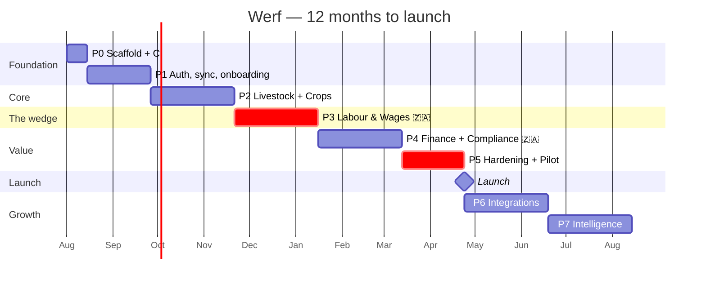

# Roadmap

> **⚠️ Authority: this document is authoritative for SHAPE only — the phases, their sub-phases,
> their content, their gates and their autonomy levels. [`STATUS.md`](../../STATUS.md) is
> authoritative for SEQUENCING AND TIMING: where the build actually is, what is merged, and what
> comes next.** The Gantt chart below is a plan drawn before the work started and its dates are
> already wrong; do not plan a session off it. If the two disagree about *when*, STATUS.md wins
> without argument. If they disagree about *what a phase contains*, this file wins — and
> [claude-code-playbook.md](claude-code-playbook.md)'s autonomy table is generated from this one.

Eight phases. Each ends at a **gate** — a command that exits 0, plus a human judgement that cannot be automated. Phases are sized so a Claude Code session can carry one sub-phase without the context window degrading.

**The gate is the whole design.** It is what makes a phase safe to run unattended: Claude works until the gate passes, and the gate is a fact rather than an opinion. See [claude-code-playbook.md](claude-code-playbook.md).

---

## Shape



~44 weeks to launch. Phase 3 and Phase 5 are critical path and are the two most likely to slip. Phase 3 because payroll correctness is not negotiable and the external legal review is on someone else's calendar; Phase 5 because pilot farms discover things no test does.

---

## Phase 0 · Scaffold (2 weeks)

**Ships:** an empty monorepo where `pnpm verify` passes, CI is green, and one page deploys to staging.

| | |
|---|---|
| Build | pnpm + Turborepo; `apps/{web,api,worker}`; `packages/{core,domain,db,sync,ui,i18n}`; Vitest + Playwright + Testcontainers; ESLint/Prettier; the **custom lint rule for regulated constants** (NFR-507); GitHub Actions; Terraform for af-south-1; `.claude/` config per the playbook; **public GitHub repo, AGPL-3.0, commit attribution verified** ([github-strategy.md](github-strategy.md)) |
| **Gate** | `pnpm verify` exits 0 · CI green on a PR · staging serves a page · `terraform plan` clean · **`git log --format='%an <%ae>'` shows your GitHub email** |
| Human check | Read the ADRs. Disagree now, not in Phase 4. |
| Autonomy | **High.** No product decisions. Let it run. |

> The regulated-constants lint rule ships in Phase 0, before there is any payroll code to lint. That is deliberate: the rule must exist before the temptation does.

---

## Phase 1 · Auth, sync, onboarding (6 weeks)

**Ships:** a farmer can register, pick what they farm, install the PWA, create a camp, go offline, create an animal, come back, and see it on another device.

This phase proves the two riskiest bets in the product. If offline-first does not work, or if enterprise adaptation is a mess, we need to know in week eight, not week thirty.

| Sub-phase | Content | Gate |
|---|---|---|
| 1a | Postgres + PostGIS + Drizzle; core schema; **RLS on every table**; migrations | Schema tests pass; **RLS tenancy test passes** |
| 1b | Auth: register, OTP, login, JWT, refresh rotation, **30-day offline session**; RBAC guards | Auth suite; offline-session test |
| 1c | PWA shell; service worker; install prompt; SQLite/OPFS via PowerSync; sync rules; **`packages/sync/test/tenancy.spec.ts`** | **Offline write survives reboot**; tenancy test passes |
| 1d | Onboarding; enterprise-type selection; **runtime UI adaptation**; **the home grid**; terminology layer; en-ZA + af-ZA | US-001 all four scenarios; **grid generated from `enterprise_types`, not a static array** |
| 1e | Design system in `@werf/ui`; **light + dark tokens**; Storybook; capture card; sync strip | `axe-core` 0 violations **in both themes**; bundle < 250KB |
| 1f | **2FA: passkey + TOTP + recovery codes** ([ADR-0007](../03-architecture/adr/ADR-0007-authentication.md)) | Both factors work **offline**; no SMS second factor anywhere |

**Gate:**
```
✓ pnpm verify
✓ pnpm test:e2e                  ← incl. the offline path: write offline, reboot,
                                   reopen, record present (apps/web/e2e/offline-capture.spec.ts)
                                 ⚠️ `pnpm verify` does NOT run e2e. Push and watch CI.
✓ (tenancy)                      ← sync rules and RLS agree, per table. Runs inside
                                   `pnpm test` as packages/sync/test/tenancy.spec.ts
✓ Lighthouse: perf ≥90, a11y 100
✓ Bundle ≤ 250KB gz
```
**Human check:** install it on a real Android phone. Turn on aeroplane mode. Create an animal. Reboot the phone. Open it. Is the animal there? Nothing else in this phase matters if the answer is no.

**Autonomy: medium.** 1a–1c are mechanical. **Sit with 1d** — enterprise adaptation is the product and it is a judgement call, not a spec.

---

## Phase 2 · Livestock & Crops (8 weeks)

**Ships:** the record-keeping that replaces the notebook.

| Sub-phase | Content | Gate |
|---|---|---|
| 2a | Animals, identifiers, mobs, camps; JSONB species schemas | FR-101…112 tests |
| 2b | Events: birth, death, weight, move, sale; **batch operations** | FR-104…106, 112 |
| 2c | **Weigh session** — the crush UX | US-050, all three scenarios |
| 2d | Health: treatments, vaccinations, dip; **withdrawal periods, enforced offline** | **US-032 offline scenario** |
| 2e | Breeding: mating, pregnancy, calving | FR-120…123 |
| 2f | Blocks, plantings, fertiliser, harvest | FR-201…207 |
| 2g | Sprays; **PHI enforcement at capture** | **US-030, all three scenarios** |
| 2h | Grazing, feed, inventory | FR-150…153, 501…503 |

**Gate:**
```
✓ pnpm verify
✓ All P1 livestock + crop FRs covered
✓ Offline suite green
✓ US-030 (PHI) and US-032 (withdrawal) pass OFFLINE
✓ Local query <100ms on a 5,000-animal seed
```
**Human check:** show 2c to someone who has actually worked a crush. Time them. If a weight takes more than four seconds, the phase is not done regardless of what the tests say.

**Autonomy: high** for 2a–2b, 2e–2f, 2h. **Low for 2c** (UX judgement). **Medium for 2d, 2g** — read [legal-compliance.md §4.3](../00-business/legal-compliance.md) first; the enforcement rules are legal, not technical.

---

## Phase 3 · Labour & Wages 🇿🇦 (8 weeks) — CRITICAL

**Ships:** the wedge. A farm can pay people correctly and prove it.

> **Before this phase begins:**
> 1. **Re-verify every figure in [legal-compliance.md §2.2](../00-business/legal-compliance.md) against the current Government Gazette.** The numbers in this pack were correct in July 2026 and decay annually.
> 2. **Book the labour-law review now.** It is on someone else's calendar and it gates the phase.

| Sub-phase | Content | Gate |
|---|---|---|
| 3a | `regulatory_rates` **with `jurisdiction`**; `rates.lookup(jurisdiction, code, occurredAt)`; seed with gazette refs; **admin UI (FR-615)**; `PayrollRules` interface with **one** impl (`ZA`) | Lookup resolves by `occurred_at`; a missing rate **throws**; **no SA statute names outside `jurisdictions/za/`** |
| 3b | Employees; encrypted ID/banking; **age verification** | FR-301, 318; NFR-203 |
| 3c | Attendance (PIN + GPS, **no biometrics**); piece work | FR-303, 304 offline |
| 3d | **Payroll engine** — pure functions in `packages/domain`, no I/O | **US-020, US-021, US-022 all scenarios** |
| 3e | Compliance warnings; blocking logic | **US-021 rejection scenario** |
| 3f | Payslips (s33), contracts (s29), **in the employee's language** | FR-302, 308; SRS-20 |
| 3g | **BCEA s31 record — the inspector-at-the-gate report** | **US-023** |
| 3h | Leave; UIF/SARS/EFT exports | FR-310, 312, 313, 316 |
| 3i | **External labour-law review** | Sign-off, in writing |

**Gate:**
```
✓ pnpm verify
✓ Payroll domain coverage ≥95%    ← higher than anywhere else, on purpose
✓ Every US-02x scenario passes
✓ Period spanning 1 March uses BOTH rates      ← the every-year case
✓ Correction run for Feb uses Feb's rate
✓ NO regulated constant in code (lint rule)
✓ External labour-law review signed off
```
**Human check:** hand-calculate one payslip. On paper. Compare it. Then hand a real payslip to someone who has been a farm bookkeeper for twenty years and watch their face.

**Autonomy: LOW.** This is the phase where an autonomous run produces confident, wrong, legally-consequential code. Use `/goal` with a tight condition, review every diff, and **never let 3d–3e run unattended.** The rest of the roadmap is about shipping; this phase is about not getting a farmer sued.

---

## Phase 4 · Finance & Compliance 🇿🇦 (8 weeks)

**Ships:** the reason an owner pays, and the reason they renew.

| Sub-phase | Content | Gate |
|---|---|---|
| 4a | Income, expenses, chart of accounts, enterprise attribution | FR-401…404 |
| 4b | Cost of production; livestock gross margin; budgets | FR-405…407 |
| 4c | **Branding register** (Animal ID Act); unmarked-animal flag | FR-601, 602 |
| 4d | **Stock theft evidence pack** | **US-031, both scenarios** |
| 4e | GlobalGAP checklist engine + evidence mapping | UC-040 |
| 4f | **SIZA pack from labour records** | FR-320, 607 |
| 4g | Obligations register | FR-609 |
| 4h | Reports, dashboards, PDF/CSV | FR-701…710 |

**Gate:**
```
✓ pnpm verify
✓ Evidence pack contains every element in US-031
✓ Evidence pack has NO suspect field           ← asserted by test
✓ GlobalGAP checklist auto-maps evidence
✓ Pack generation <15s
```
**Human check:** give the GlobalGAP pack to a real auditor and the theft pack to a real Stock Theft Unit officer. Ask what is missing. They will tell you, and they will be right.

**Autonomy: high** for 4a–4b, 4h. **Medium** for 4c–4g — the *content* is legal, the *engine* is code.

---

## Phase 5 · Hardening & Pilot (6 weeks) — CRITICAL

**Ships:** launch, or the decision not to.

| Sub-phase | Content |
|---|---|
| 5a | Import (CSV, BenguFarm, Farmbrite, Logix); **export (POPIA s23)** |
| 5b | Performance against every NFR-0xx budget, on the reference device |
| 5c | **External penetration test** (NFR-214) |
| 5d | Monitoring, alerting, runbooks, on-call |
| 5e | **Pilot: 3 farms — livestock, crop, mixed — one full month** |
| 5f | Fix what the pilot found |
| 5g | Launch readiness review |

**Gate — and this one does not bend:**
```
✓ pnpm verify
✓ Every NFR-0xx budget met ON THE REFERENCE DEVICE (Galaxy A15, 3G)
✓ Pen test: zero criticals, zero highs
✓ 3 pilot farms, 1 month, Werf as their ONLY record system
✓ ≥1 pilot ran a real pay cycle on Werf
✓ ≥1 pilot passed a real audit or inspection on Werf output alone
✓ Zero data-loss incidents
✓ Restore drill executed and timed
```

> **We do not launch without this gate.** A farm management product that loses data or gets a payslip wrong does not get a second chance in a community this tightly networked. Word travels faster at a Nampo stand than any marketing budget can outrun. If the gate is not met, we fix and re-pilot.

**Autonomy: low.** This phase is mostly judgement.

---

## Phase 6 · Integrations (8 weeks, post-launch)

SA Stud Book / BREEDPLAN import · SwiftVEE listings · PayFast billing · weather · accounting export · Web Bluetooth EID + scale (Android; manual always present) · web push.

**Gate:** each integration degrades gracefully to manual. **Kill any one and the product still works** — verified by test, not by assertion.

**Autonomy: high.** Well-specified, externally-bounded, low product judgement.

---

## Phase 7 · Intelligence (8 weeks)

AI photo disease diagnosis · benchmarking (opt-in, anonymised) · forecasting · **USSD/SMS channel** · isiZulu + isiXhosa.

**Two constraints, both non-negotiable:**
- **Any AI feature must scrub PII before data leaves South Africa, or run locally** ([legal-compliance.md §1.4](../00-business/legal-compliance.md), NFR-212). This is a code gate, not a settings toggle.
- **Ship AI with honest accuracy claims.** Vendor claims in this space (93–97% weight estimation) are largely unverified. Measure ours, state the number, and let farmers decide.

**Autonomy: medium.**

---

## Deliberate exclusions

Named so nobody relitigates them in month six.

| Not building | Why | Instead |
|---|---|---|
| Marketplace / auctions | SwiftVEE has a R173m Series A and the liquidity. We would lose. | Integrate (P6) |
| Lending / fintech | Regulated. Different company. | Partner |
| IoT collars | Hardware supply chain, support burden. Violates BC-5. | Integrate FarmRanger |
| Drone / satellite imagery | Aerobotics has a decade of tree-crop models | Integrate (P7) |
| Full accounting GL | Not our fight. Farmers have accountants. | Export (P6) |
| Stud-book-grade genetics | BenguFarm has 20 years and SA Stud Book endorsement | Import (P6) |
| Ration formulation | Specialist domain, small market | Never |
| Native apps | [ADR-0001](../03-architecture/adr/ADR-0001-pwa-over-native.md) | Capacitor if forced |
| Biometric attendance | POPIA s26; consent from an employer to a farm worker is of questionable voluntariness | PIN + GPS |
| Suspect fields on theft records | Defamation for our customer, POPIA s26 for us | Facts only |

---

## Where this slips

| Risk | Likelihood | Response |
|---|---|---|
| Phase 3 payroll takes longer than 8 weeks | **High** | Accept it. Do not compress. |
| Legal review is late | Medium | Book it in Phase 2, not Phase 3 |
| Pilot finds something structural | Medium | 5f exists for this. Re-pilot rather than launch. |
| Sync bug found late | Low, severe | Phase 1 gate is designed to surface it in week 8 |
| Enterprise adaptation is a mess | Medium | Same — Phase 1d, deliberately early |
| Scope creep from a pilot farm | **High** | The exclusions table above. Read it out loud. |

The two structural risks — offline-first and enterprise adaptation — are both proved or disproved by the **Phase 1 gate**. That is the entire reason Phase 1 is six weeks and not two. If either bet is wrong, we find out in week eight with 10% of the budget spent, not in week thirty with 70%.
