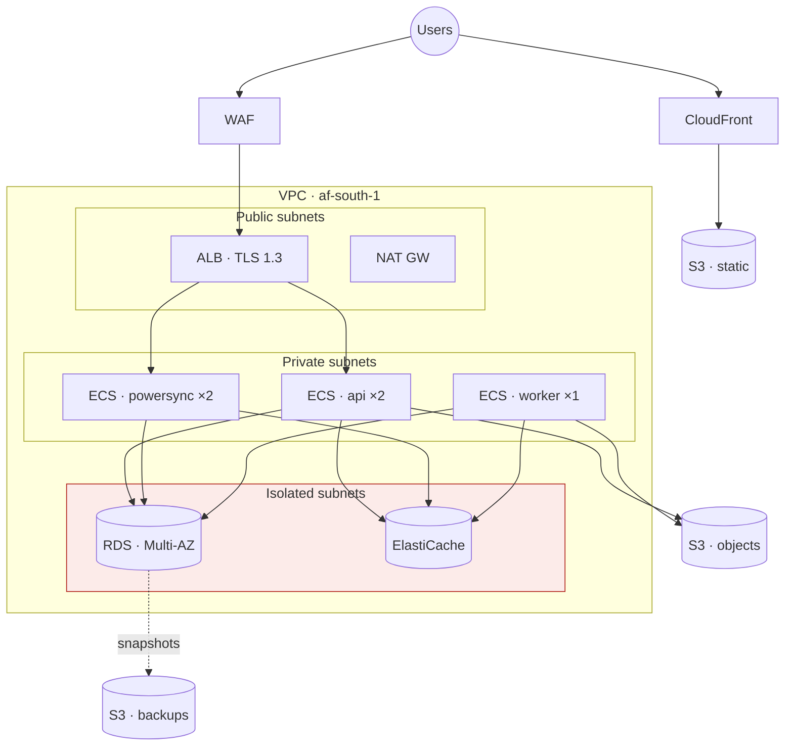

# Deployment Guide

Laptop to production. Everything containing personal information lives in **af-south-1 (Cape Town)** — see [ADR-0002](../03-architecture/adr/ADR-0002-data-residency.md).

---

## 1. Local

### Prerequisites

**Install now** — everything `pnpm verify` and the local loop need:

| | Version | Note |
|---|---|---|
| Node | ≥22.13 | Enforced by `engines`. pnpm 11 refuses to run below it. |
| pnpm | 11.14.0 | Pinned exactly by `packageManager`; `corepack enable` honours it. Do not install a different major by hand. |
| Docker | 24+ | Postgres today; Redis and PowerSync join `docker-compose.yml` at Phase 3. Also required for testcontainers, so the API integration tests cannot run without it. |
| gitleaks | 8.19+ | The `.githooks/pre-commit` secret scan. Without it the hook warns and waves the commit through, leaving CI as the only gate. On Windows pin the source — `winget install --id Gitleaks.Gitleaks --source winget` — because the msstore source fails a certificate check on some machines. |
| Playwright browsers | chromium | `pnpm exec playwright install chromium`. Chromium only: `playwright.config.ts` declares a single project. |

**Install later, when a phase actually needs them.** Nothing below is required to build, test, or run
Werf locally, and `hosting-and-cost-control.md` §2 is deliberate about not turning services on early.

| | Version | Needed from |
|---|---|---|
| Terraform | 1.9+ | Production infra only. [ADR-0008](../03-architecture/adr/ADR-0008-dev-hosting.md) keeps the whole build on Neon/Render/Cloudflare with synthetic data; AWS re-enters at `af-south-1` before the first real farm onboards. |
| AWS CLI | v2 | Same — deploying to `af-south-1`, not before. |
| `psql` | — | Optional. The postgis container ships with it: `docker compose exec postgres psql -U werf werf`. |

### Start

```bash
git clone git@github.com:<org>/werf.git && cd werf
pnpm install
cp .env.example .env.local          # never commit this
docker compose up -d                # postgres+postgis, redis, powersync
pnpm db:migrate
pnpm db:seed                        # 3 farms: livestock, crop, mixed
pnpm dev                            # web :5173 · api :3000 · powersync :8080
pnpm verify                         # must exit 0 before you write anything
```

```yaml
# docker-compose.yml
services:
  postgres:
    image: postgis/postgis:16-3.4
    environment:
      POSTGRES_DB: werf
      POSTGRES_PASSWORD: werf
    command:
      - postgres
      - -c
      - wal_level=logical          # ⭐ PowerSync needs logical replication
      - -c
      - max_replication_slots=10
    ports: ["5432:5432"]
    volumes: ["pgdata:/var/lib/postgresql/data"]

  redis:
    image: redis:7-alpine
    ports: ["6379:6379"]

  powersync:
    image: journeyapps/powersync-service:latest
    depends_on: [postgres]
    environment:
      POWERSYNC_CONFIG_PATH: /config/powersync.yaml
    volumes: ["./packages/sync/config:/config"]
    ports: ["8080:8080"]

volumes: { pgdata: }
```

**`wal_level=logical` is not optional.** PowerSync replicates via the write-ahead log. Without it the sync service starts, connects, and silently replicates nothing — which presents as "sync is broken" with no error anywhere. This is the first thing to check when local sync mysteriously does nothing.

### Testing offline locally

```bash
pnpm test:e2e:offline          # the automated matrix

# By hand — Chrome DevTools → Network → Offline is NOT enough.
# It doesn't survive a reload the way a real dead zone does.
# Use the emulator with airplane mode, or a real phone on the same LAN:
pnpm dev --host                # then http://<your-lan-ip>:5173 on the phone
```

**The DevTools offline toggle lies.** It intercepts fetch but leaves the service worker and OPFS in a state that a real signal loss doesn't produce. Test the offline path on a real device before believing it works. This has bitten every offline-first project that has ever existed.

---

## 2. Infrastructure

```
infra/
├── modules/
│   ├── network/          # VPC, subnets, NAT, SGs
│   ├── database/         # RDS Postgres 16 + PostGIS, Multi-AZ
│   ├── compute/          # ECS Fargate, ALB
│   ├── storage/          # S3 (objects, static, backups)
│   ├── cdn/              # CloudFront + WAF
│   └── observability/    # CloudWatch, alarms
└── envs/
    ├── staging/
    └── production/
```

```hcl
# infra/envs/production/main.tf
provider "aws" {
  region = "af-south-1"                    # ⭐ Cape Town. Not a variable.
  default_tags { tags = { Project = "werf", Env = "production" } }
}

module "database" {
  source = "../../modules/database"

  engine_version          = "16.4"
  instance_class          = "db.t4g.medium"     # start here; measure before growing
  multi_az                = true                # NFR-101
  storage_encrypted       = true
  backup_retention_period = 30                  # NFR-108
  deletion_protection     = true

  # ⭐ PowerSync
  parameter_group_params = {
    "rds.logical_replication" = "1"
    "max_replication_slots"   = "20"
    "max_wal_senders"         = "20"
    "wal_sender_timeout"      = "0"     # long-running slots must not be reaped
  }
}
```

```bash
cd infra/envs/production
terraform init
terraform plan -out=tfplan       # read this. actually read it.
terraform apply tfplan
```

**Terraform only. No console changes, ever.** A console change is invisible to the next `terraform apply`, which will either revert it silently or fail confusingly. If something must change, it changes in code.

**On `wal_sender_timeout = 0`:** a PowerSync replication slot is long-lived by design. The default timeout reaps it, sync stops, and the failure is silent until someone notices a farm hasn't synced in six hours. This parameter is the fix and it is easy to lose in a parameter-group refactor.

---

## 3. Topology



| Tier | What | Access |
|---|---|---|
| Public | ALB, NAT | Internet ingress |
| Private | ECS tasks | Egress via NAT only |
| **Isolated** | **RDS, Redis** | **No internet route. In or out.** |

The isolated tier has no NAT route. The database cannot reach the internet and the internet cannot reach the database, and an exfiltration attempt from a compromised container has nowhere to send anything.

### Sizing — start small, measure, then grow

| Service | Start | At 1,000 farms |
|---|---|---|
| API | 2 × 0.5 vCPU / 1GB | 4 × 1 vCPU / 2GB |
| PowerSync | 2 × 1 vCPU / 2GB | 4 × 2 vCPU / 4GB |
| Worker | 1 × 0.5 vCPU / 1GB | 2 × 1 vCPU / 2GB |
| RDS | db.t4g.medium | db.r6g.large + read replica |
| Redis | cache.t4g.micro | cache.t4g.small |

Roughly R6,000–9,000/month at the starting size. **af-south-1 costs more per unit than eu-west-1** — that is part of the price of [ADR-0002](../03-architecture/adr/ADR-0002-data-residency.md), and it is a price worth paying.

**PowerSync gets more memory than the API.** It holds replication state and streams to many concurrent clients; it is the thing that falls over first under load, and it is the thing whose failure is least visible.

---

## 4. Deploying

Normal path: [ci-cd.md](../04-delivery/ci-cd.md). Manual, when you must:

```bash
# 1. Snapshot. Always. It costs 30 seconds.
aws rds create-db-snapshot \
  --db-instance-identifier werf-prod \
  --db-snapshot-identifier manual-$(date +%Y%m%d-%H%M) \
  --region af-south-1

# 2. Migrate (additive-only — old code must run against the new schema)
DATABASE_URL=$PROD_URL pnpm db:migrate

# 3. Images
docker build -t $ECR/api:$SHA -f apps/api/Dockerfile .
docker push $ECR/api:$SHA

# 4. Deploy
aws ecs update-service --cluster werf-prod --service api \
  --task-definition werf-api:$REV --force-new-deployment --region af-south-1
aws ecs wait services-stable --cluster werf-prod --services api --region af-south-1

# 5. Static
aws s3 sync apps/web/dist s3://werf-prod-web --delete
aws cloudfront create-invalidation --distribution-id $CF_ID --paths "/*"

# 6. Smoke
pnpm test:smoke --base-url https://app.werf.co.za
```

### The migration rule, restated because it is the one that bites

**Additive-only.** Add a column, backfill, switch reads, drop the old one **two releases later**.

Not conservatism — arithmetic. A farmer's phone has been offline for six weeks holding lambing records composed against a schema from two releases ago. When they sync, those writes must land. "Roll back and nobody notices" is not available to us; somebody's phone is always in the past.

```
Release N     : ADD COLUMN new_thing (nullable)
Release N     : write both old_thing and new_thing
Release N+1   : backfill; switch reads to new_thing
Release N+2   : stop writing old_thing
Release N+3   : DROP COLUMN old_thing        ← by now every client has caught up
```

Four releases to rename a column. That is the cost of an offline client, and it is cheaper than the alternative.

---

## 5. Rollback

```bash
# Code — a traffic shift. Under 5 minutes (NFR-708).
aws ecs update-service --cluster werf-prod --service api \
  --task-definition werf-api:$PREVIOUS_REV --force-new-deployment

# Static — previous build is versioned in S3
aws s3 sync s3://werf-web-releases/$PREVIOUS_SHA/ s3://werf-prod-web --delete
aws cloudfront create-invalidation --distribution-id $CF_ID --paths "/*"
```

**Migrations do not roll back. Roll forward.** Write a new migration that corrects the problem. The snapshot from step 1 exists for catastrophe (data corruption), not for "this deploy was wrong" — restoring it loses every write since the snapshot, including a farmer's morning.

---

## 6. Backups & restore

| | |
|---|---|
| Automated | RDS, 30 days, PITR to 5 minutes (NFR-106) |
| Monthly | 12 retained |
| Annual | 7 retained (NFR-108) |
| Region | **af-south-1 only.** Cross-region backup is a transborder flow. |
| Objects | S3 versioning + lifecycle |

```bash
# Point-in-time restore
aws rds restore-db-instance-to-point-in-time \
  --source-db-instance-identifier werf-prod \
  --target-db-instance-identifier werf-restore-$(date +%s) \
  --restore-time 2026-07-17T09:30:00Z \
  --region af-south-1
```

### The quarterly restore drill (NFR-109)

**Not optional. A backup that has never been restored is not a backup; it is a hope.**

```
1. Restore the latest snapshot to a new instance
2. Point a staging API at it
3. Verify: farm count, animal count, a payroll run reproduces
4. TIME IT. RTO is 4 hours (NFR-107). Is it?
5. Write down what went wrong. Something always does.
6. Destroy the instance.
```

Calendar item. Named owner. If it has slipped a quarter, the RTO in the NFRs is fiction.

---

## 7. Domains & TLS

| | |
|---|---|
| `app.werf.co.za` | CloudFront → S3 (PWA) |
| `api.werf.co.za` | ALB → ECS |
| `sync.werf.co.za` | ALB → PowerSync |
| Certificates | ACM, auto-renewed. CloudFront needs **us-east-1**; ALB needs **af-south-1**. Two certs. |
| DNS | Route 53 |

The two-certificate thing catches everyone once. CloudFront only reads certificates from us-east-1 regardless of where anything else lives.

---

## 8. First production deploy

```
□ terraform apply, both envs, plan reviewed by a human
□ Secrets in Secrets Manager — none in git (gitleaks --log-opts=--all)
□ RDS: Multi-AZ, encrypted, deletion protection, logical replication on
□ wal_sender_timeout = 0                            ← the silent killer
□ Isolated subnets have no NAT route
□ WAF rules active
□ TLS: SSL Labs A+
□ Two ACM certs (us-east-1 for CDN, af-south-1 for ALB)
□ CSP headers verified
□ Backups running; PITR on
□ RESTORE DRILL EXECUTED AND TIMED             ← before launch, not after
□ Alerts wired, each with a runbook link (NFR-705)
□ Replication slot lag alarm                   ← the WAL footgun
□ Per-farm sync health dashboard (NFR-710)
□ Sentry PII scrubbing verified with a real 13-digit test
□ Smoke tests pass against production
□ Rollback rehearsed
□ On-call rota exists and someone has acknowledged it
```

**The restore drill is on this list deliberately.** Doing it for the first time during an incident is how a four-hour RTO becomes a two-day outage.
